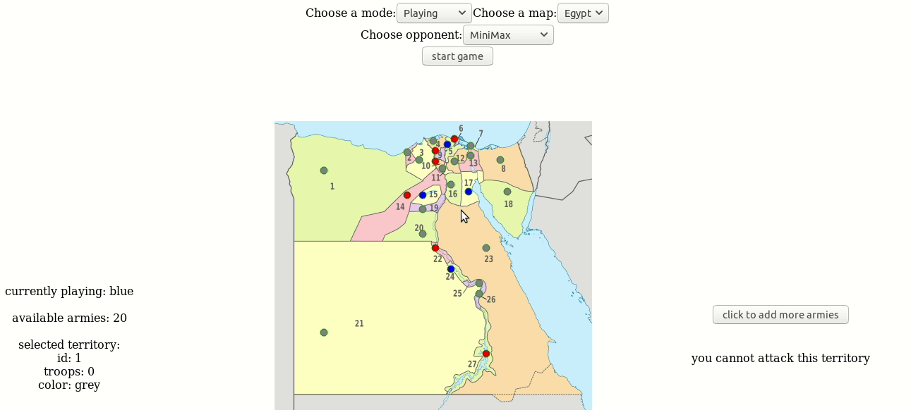

# riskgame
AI agents are built in python and client is built in ReactJS

# Sample Run (Human vs Minimax)




# Agents Incorporated:
 - Passive Agent
 - Aggressive Agent
 - Minimax Agent
 - AStar Agent
 
# Maps Supported:
 - Egypt https://github.com/youssef-sherif/riskgame/blob/master/client/src/egypt-map.png
 - USA  https://github.com/youssef-sherif/riskgame/blob/master/client/src/usa-map.png
 - note: Egypt.txt / USA.txt contains neighbour arrays and Egypt_Coordinates.txt / USA_Coordinates.txt contains the coordinates of   the territories on the SVG

# Features:
 - Human vs AI
 - Simulation of AI vs AI using web sockets (Flask SocketIO)

# Installation (Tested on Ununtu 18.04)
 # Python3 Flask API
  ```
  $ pip3 install flask flask_cors flask_socketio
  $ python3 Api.py
  ```
 # ReactJS
  This project was originally bundled using Create React App.

  - Install dependencies
```
  $ cd client
  $ npm install
```

  - For development build
```
  $ yarn start
```

  - For production build
```
  $ yarn build
  $ serve -s build/
```
